# Networks Security Project Report

**Course:** Networks Security (CCY3201)  

**Lecturer:** Prof. Dr. Ayman Adel Abdel-Hamid  

**TAs:** Abdelrahman Solyman  

**Date:** May 2025

### Team:

- Ahmed Walid Ibrahim

- Ahmed Mohamed Mahmoud
  
  ---

## Table of Contents

- [Project Overview](#project-overview)
- [Part 1: TLS Implementation](#part-1-tls-implementation)
- [Part 2: SSH Configuration](#part-2-ssh-configuration)
- [Bonus: Firewall IDS](#bonus-firewall-ids)
- [Deliverables](#deliverables)
- [Team Plan](#team-plan)

---

## Project Overview

This project demonstrates the implementation and analysis of secure network communications using TLS/SSL and SSH protocols, along with firewall and intrusion detection system configuration. The project is divided into three main parts:

1. **TLS Implementation** - Creating a secure HTTPS web application using OpenSSL
2. **SSH Configuration** - Setting up secure SSH connections with key-based authentication
3. **Bonus: Firewall IDS** - Implementing pfSense with Snort for network security

### Virtual Machine Setup

- **Client VM:** Kali Linux (Part 1) and Fedora Linux (Part 2)
- **Server VM:** Kali Linux
- **Firewall VM:** pfSense
- **Vulnerable VM:** Metasploitable2

---

## Part 1: TLS Implementation

### Overview

Implementation of a secure HTTPS web application using OpenSSL with certificate generation, TLS client-server communication, and traffic analysis using Wireshark.

### 1.1 Certificate Generation

#### Root CA Certificate Creation

First, we created a Root Certificate Authority (CA) to sign both client and server certificates.

**Commands used:**

```bash
mkdir ~/tls_cert && cd ~/tls_cert
openssl genrsa -out rootCA.key 2048
openssl req -x509 -new -nodes -key rootCA.key -sha256 -days 1024 -out rootCA.pem -config root.cnf
```

**Configuration Files:**

- [Root CA Configuration and Keys](./Part%201%20(SSL)/RootCA)
- [Server Configuration and Keys](./Part%201%20(SSL)/sever)

#### Server Certificate Creation

```bash
openssl genrsa -out server.key 2048
openssl req -new -key server.key -out server.csr -config server.cnf
openssl x509 -req -in server.csr -CA rootCA.pem -CAkey rootCA.key -CAcreateserial -out server.crt -days 500 -sha256 -extfile server.cnf -extensions v3_req
```

/Screenshots/rootca_generation.png)

/Screenshots/root_cnf.png)

#### Client Certificate Creation

```bash
openssl genrsa -out client.key 2048
openssl req -new -key client.key -out client.csr
openssl x509 -req -in client.csr -CA rootCA.pem -CAkey rootCA.key -CAcreateserial -out client.crt -days 500 -sha256
```

/Screenshots/client_cert_generation.png)

### 1.2 Certificate Storage and Security

**Best Practices for Certificate Storage:**

- **Root CA Private Key:** Stored securely with restricted access (600 permissions)
- **Server Private Key:** Stored on server with limited access (600 permissions)
- **Client Private Key:** Stored on client with user-only access (600 permissions)
- **Public Certificates:** Can be shared (644 permissions)

**File Locations:**

- Root CA files: [Root CA Directory](./Part%201%20(SSL)/RootCA/)
- Server files: [Server Directory](./Part%201%20(SSL)/server/)
- Client files: [Client Directory](./Part%201%20(SSL)/client/)

### 1.3 TLS Client-Server Application

#### Server Implementation

The server application implements HTTPS using Python's ssl module with OpenSSL certificates.

**Key Features:**

- TLS/SSL encryption
- Certificate-based authentication
- Simple HTTP response with HTML content

[Server Code](./Part%201%20(SSL)/server/server.py)

/Screenshots/serverpy.png)

#### Client Implementation

The client connects to the server using TLS with certificate verification.

[Client Code](./Part%201%20(SSL)/client/client.py)

/Screenshots/clientpy.png)

### 1.4 Traffic Capture and Analysis

#### Wireshark Capture

Traffic was captured during the TLS handshake and data exchange process.

**Captured Files:**

- [Encrypted Traffic](./Part%201%20(SSL)/encrypted_server.pcapng)

/Screenshots/wireshark_capture.png)

#### Running the Server

The captured traffic shows the complete TLS handshake process:

1. Client Hello
2. Server Hello
3. Certificate Exchange
4. Key Exchange
5. Finished Messages
6. Application Data

/Screenshots/runningTheServer.png)

Using the session key to decrypt the captured TLS traffic reveals the plain HTTP packets.

/Screenshots/runningTheClient.png)

### 1.6 Protocol Analysis

**TLS Version:** TLS 1.3
**Cipher Suite:** TLS_AES_256_GCM_SHA384
**Key Exchange:** ECDHE (Elliptic Curve Diffie-Hellman Ephemeral)
**Authentication:** RSA with SHA-256

/Screenshots/tls_cert.png)

---

## Part 2: SSH Configuration

### Overview

Configuration of SSH service with key-based authentication

### 2.1 SSH Installation and Setup

#### Server Setup (Kali Linux VM)

```bash
sudo apt update
sudo apt upgrade
sudo apt install openssh-server openssh-client
sudo systemctl enable ssh # To have it autostart
sudo systemctl start ssh # To start it for only this session
```

/Screenshots/1EnableSSH.png)

#### Key Generation

Generated two key pairs using different algorithms:

**ED25519 Keys:**

```bash
ssh-keygen -t ed25519 -f ~/.ssh/id_ed25519 -C "ahmed@ahmedpc"
```

/Screenshots/3ed25519KeygenOnHostMachine.png)

**RSA Keys:**

```bash
ssh-keygen -t rsa -b 4096 -f ~/.ssh/id_rsa -C "ahmed@ahmedpc"
```

/Screenshots/4RSAKeygenOnHostMachine.png)

### 2.2 Password Authentication

Initial connection using password authentication:

```bash
ssh ahmed@192.168.1.10
```

/Screenshots/2ConnecUsingSSH.png)

### 2.3 Public Key Authentication

#### Key Distribution

Copied public key to server:

```bash
ssh-copy-id -i ~/.ssh/id_ed25519.pub ahmed@192.168.1.10
```

/Screenshots/5Copied25519SSHKeyToKaliVM.png)

#### Key-based Lo

```bash
ssh -i ~/.ssh/id_ed25519 ahmed@192.168.1.10
```

/Screenshots/keybasedlogin.png)

### 2.4 Konsole Configuration

Configured Konsole from host operating system for SSH access:

1. OpenSSH key through the Terminal Emulator
2. Configured connection settings
3. Tested both password and key authentication

/Screenshots/10ConfiguringToUseGeneratedKey.png)

### 2.5 Security Hardening

Disabled password authentication to enforce key-only access:

```bash
sudo nano /etc/ssh/sshd_config
# Set: PasswordAuthentication no
# Set: PubkeyAuthentication yes
sudo systemctl restart ssh
```

/Screenshots/Kali%20Linux-2025-05-16-18-50-33.png)

### 2.6 Traffic Analysis

#### Wireshark Capture

Captured SSH traffic during key-based authentication:

[SSH Traffic Capture](./Part%202%20(SSH)/SSHconnection.pcapng)

/Screenshots/Wireshark_SSH_Captured_Traffic.png)

#### Verbose Logging

Generated detailed SSH logs using verbose mode:

```bash
ssh -vvv -i ~/.ssh/id_ed25519 ahmed@192.168.1.10
```

**Log Files:**

- [SSH Verbose Output](./Part%202%20(SSH)/Verbose%20output.txt)
- [Verbose Output Analysis](./Part%202%20(SSH)/Verbose%20output%20explanation.md)

/Screenshots/SSHVerboseOutput.png)
[SSH Verbose](./Part%202%20(SSH)/Screenshots/SSHVerboseOutput2.png)

### 2.7 SSH Protocol Analysis

The captured traffic and verbose logs reveal:

- **SSH Version:** SSH-2.0-OpenSSH_9.9
- **Key Exchange:** curve25519-sha256
- **Host Key Algorithm:** ssh-ed25519
- **Encryption:** chacha20-poly1305@openssh.com
- **MAC:** implicit (AEAD cipher)

---

## Bonus: Firewall IDS

### Overview

Implementation of pfSense firewall with Snort/Suricata IDS to control network traffic and detect intrusions, specifically blocking direct access to Metasploitable2 and monitoring for Nmap scans.

### 3.1 Network Architecture

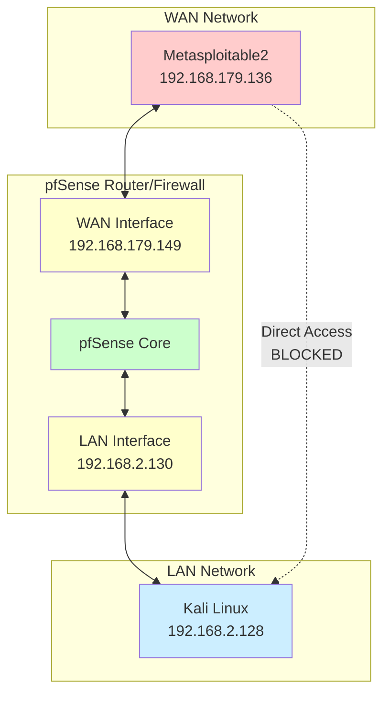

### 3.2 Environment Setup

#### Network Configuration

- **Client Network:** 192.168.1.0/24
- **DMZ Network:** 192.168.2.0/24 (Metasploitable2)
- **pfSense Interfaces:** WAN, LAN, DMZ

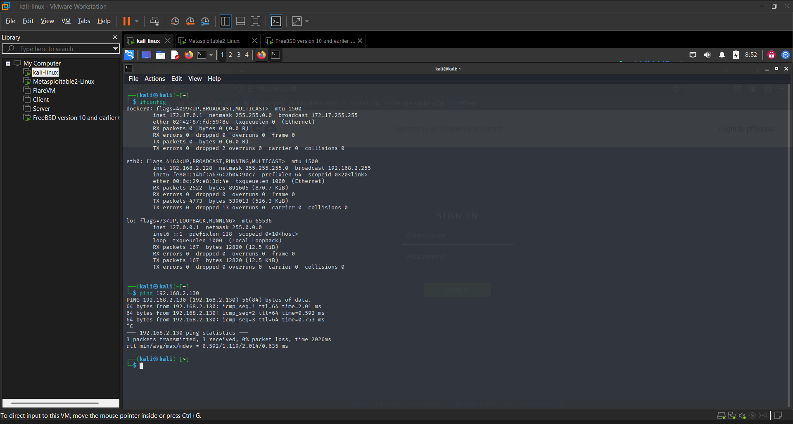

#### VM Deployment

1. **pfSense VM:** Configured as router/firewall
2. **Metasploitable2 VM:** Deployed in isolated DMZ
3. **Network Isolation:** Direct client-to-vulnerable machine access blocked

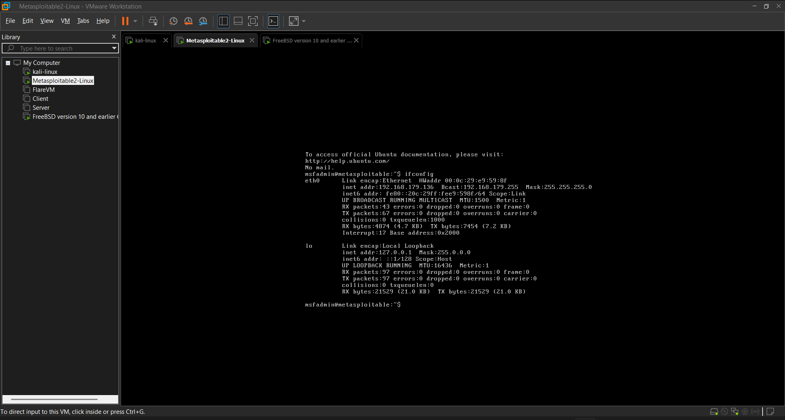

### 3.3 pfSense Configuration

#### Interface Configuration

- **WAN Interface:** Internet connection
- **LAN Interface:** Client network (192.168.1.0/24)
- **DMZ Interface:** Vulnerable machine network (192.168.2.0/24)

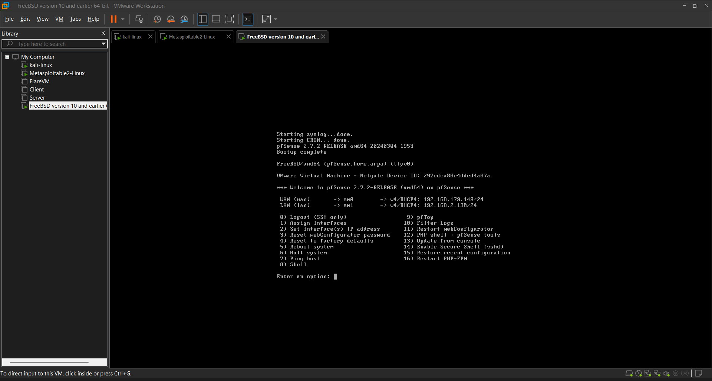

#### Routing Rules

Configured routing to force all traffic through pfSense:

```
Client → pfSense LAN → pfSense DMZ → Metasploitable2
```

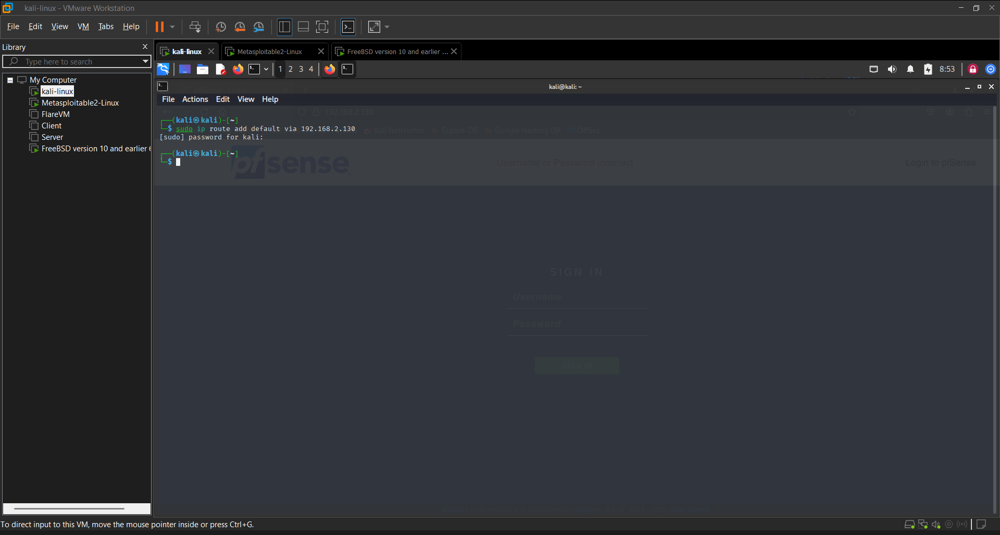

### 3.4 Intrusion Detection System

#### Snort/Suricata Installation

- Installed Snort package on pfSense
- Configured rule sets for intrusion detection
- Enabled logging for security events

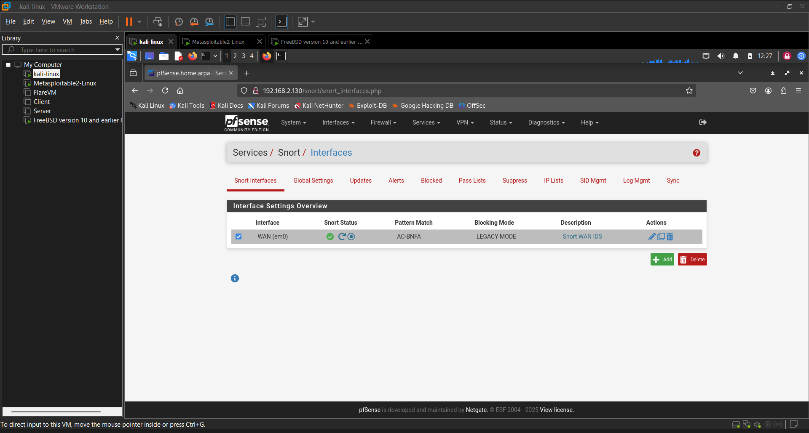

#### Rule Configuration

Custom rules to detect:

- Port scanning activities
- Nmap signatures
- Vulnerable service access attempts

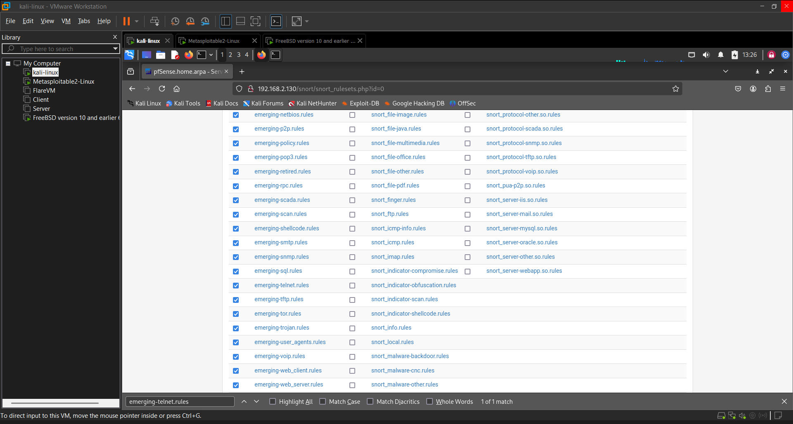

### 3.5 Vulnerability Assessment

#### Service Identification

Identified vulnerable services on Metasploitable2:

1. **SSH (Port 22):** Weak credentials
2. **HTTP (Port 80):** Web application vulnerabilities
3. **FTP (Port 21):** Anonymous access
4. **Telnet (Port 23):** Unencrypted communicatio


#### Service Blocking

Applied firewall rules to block access to two vulnerable services:

1. **FTP (Port 21):** Anonymous access vulnerability
2. **Telnet (Port 23):** Unencrypted communication

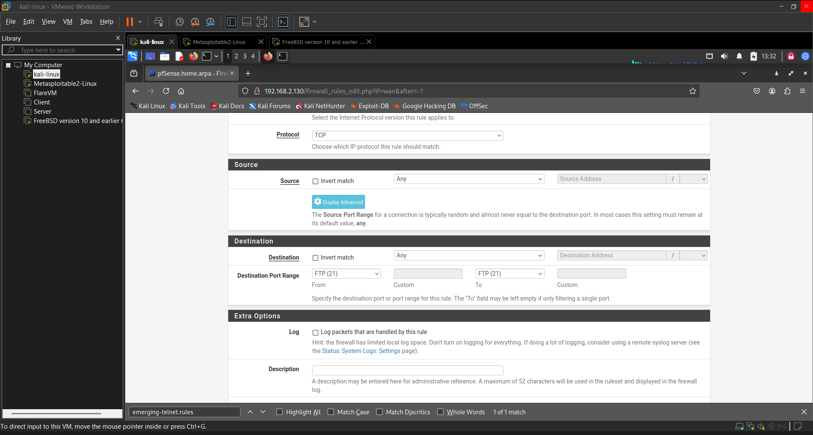
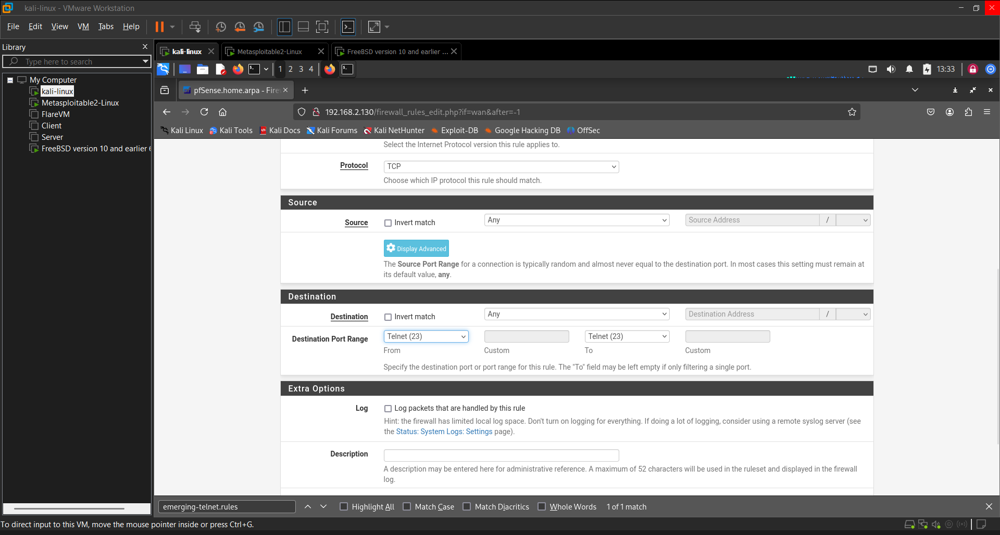

### 3.6 Attack Simulation

#### Nmap

Performed Nmap scan from client to test IDS detection:

```bash
nmap -sS -O -v 192.168.179.136
```

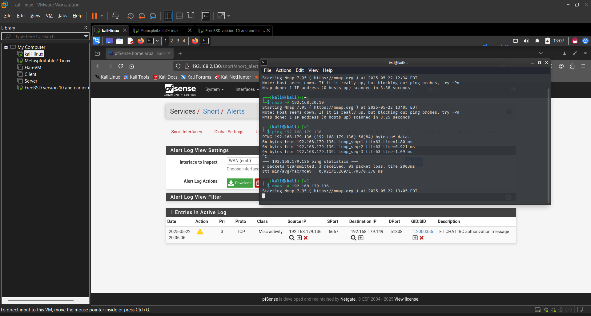

#### IDS Alerts

The IDS successfully detected and logged the Nmap scan:

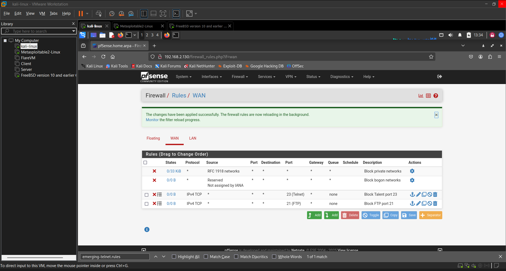

### 3.7 Log Analysis

#### Firewall Logs

- Blocked connection attempts to disabled services
- Traffic ro
- Access control enforcement


#### IDS Logs

- Port scan detection
- Suspicious traffic patterns
- Security event correlation

**IDS Log File:** [IDS Logs](./bouns/ids_logs.txt)


---

## Deliverables

### GitHub Repository

All project files and documentation are available in the GitHub repository:
https://github.com/ahmeddwalid/networks-security-TermProject

---

### Task Distribution

- **Ahmed Mohamed:**
  - Part 1: TLS Implementation
    - Certificate generation and configuration
    - Server application development
    - Traffic capture and analysis
    - Client application development
    - Traffic decryption
    - Protocol analysis and documentation
- **Ahmed Walid:**
  - Part 2: SSH Configuration
    - SSH server installation and configuration
    - Key generation and management
    - Konsole setup and configuration
    - SSH client configuration
    - Traffic capture and analysis
    - Verbose logging and documentation

#### Bonus: Firewall IDS

- **Together:**
  
  - pfSense installation and configuration
  
  - Network architecture setup
  
  - Firewall rule implementation
  
  - IDS configuration and monitoring
  
  - Vulnerability assessment
  
  - Log analysis
  
  - Testing and validation

---

All objectives were met with proper documentation, traffic capture, and security analysis demonstrating a thorough understanding of network security principles and implementation practices.
